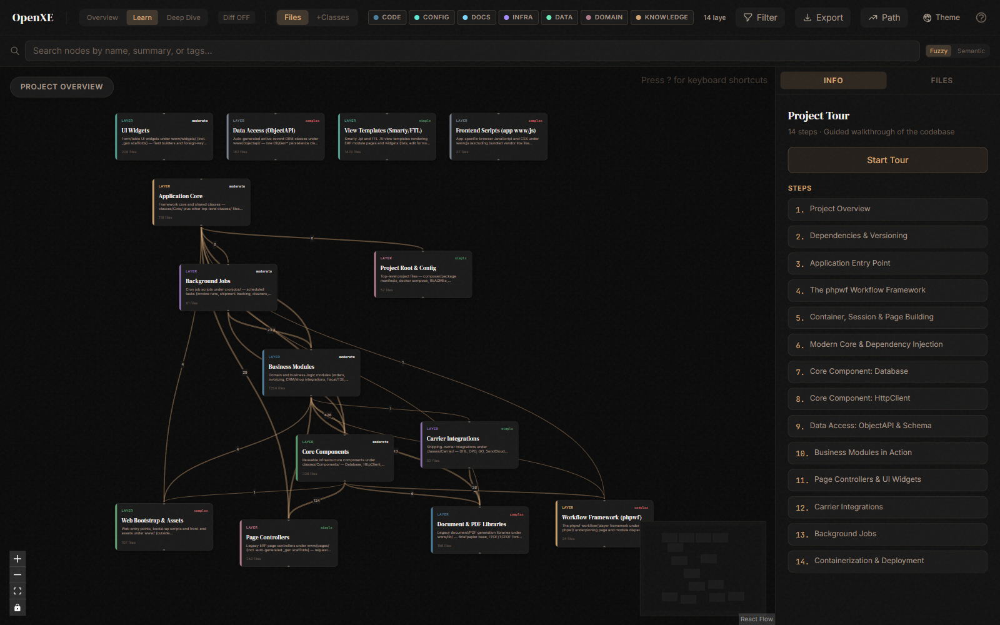
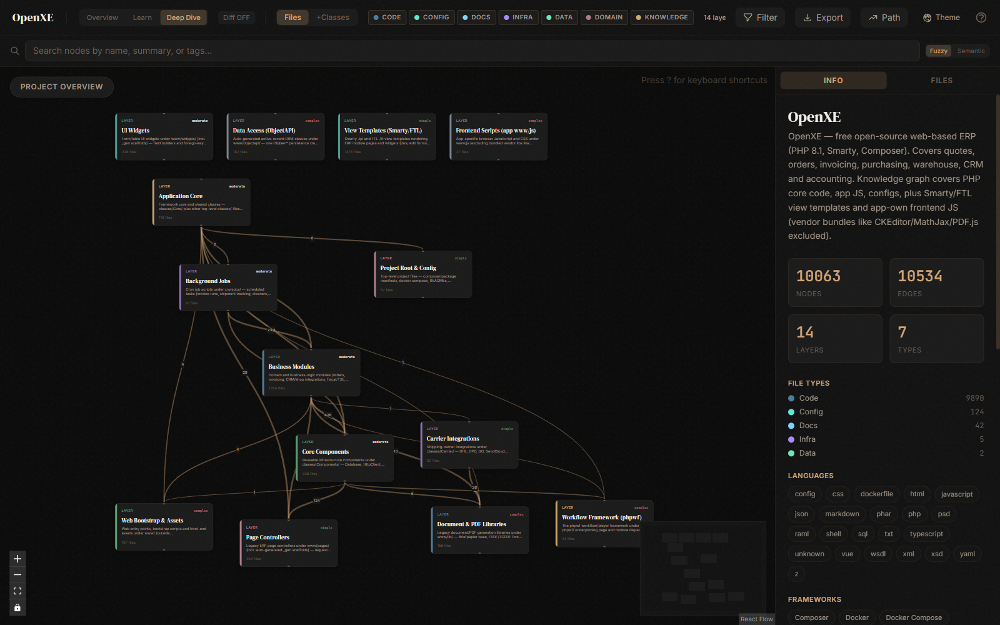
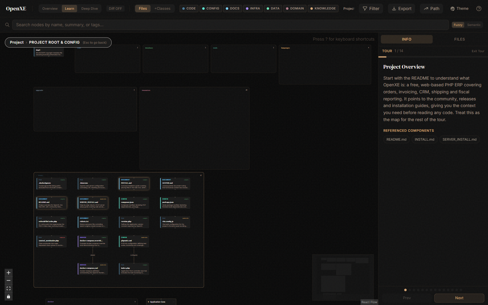
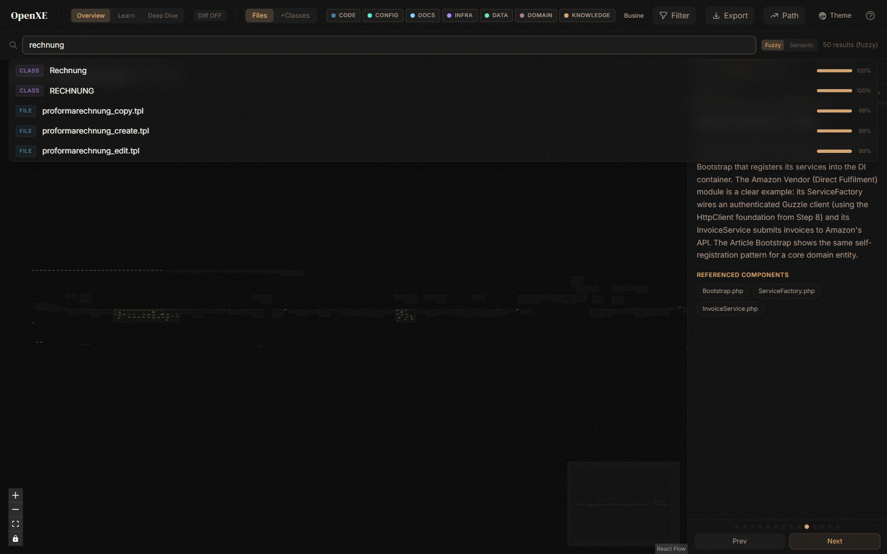

# OpenXE Knowledge Graph

Ein interaktiver Knowledge-Graph für [OpenXE](https://github.com/openxe-org/OpenXE) — dem freien webbasierten ERP — erzeugt mit dem [Understand-Anything](https://github.com/Lum1104/Understand-Anything) Claude-Code-Plugin.

Über 10.000 Nodes (Files/Classes/Functions/Configs/Docs) und 10.000+ Edges machen die Architektur durchsuchbar: zwölf Code-Layer plus die Smarty/FTL-View-Schicht und das app-eigene Frontend-JS, ergänzt um eine vierzehnstufige geführte Tour vom Einstiegspunkt bis zum Deployment.

---

## Screenshots

**Übersicht — die 14 Architektur-Layer mit Tour-Liste rechts:**



**Deep-Dive — gleiches Layout, rechts Projekt-Statistik und Sprach-/Framework-Erkennung:**



**Geführte Tour — schrittweise durch die Codebase:**



**Suche — Fuzzy-/Semantik-Suche über Name, Summary und Tags:**



---

## Was ist hier drin?

| Datei | Größe | Zweck |
|---|---|---|
| `knowledge-graph.json` | ~7,9 MB | Der vollständige Graph (Nodes, Edges, Layers, Tour, Projekt-Metadaten) |
| `meta.json` | < 1 KB | Version, Git-Commit-Hash des analysierten OpenXE-Stands, Anzahl analysierter Dateien, Zeitstempel |
| `.understandignore` | < 1 KB | Genaue Scope-Definition (welche Pfade aus-/eingeschlossen wurden) — für reproduzierbare Re-Analysen |

**Was ist NICHT drin:**
- OpenXE-Quellcode (nicht redistribuiert — siehe [openxe-org/OpenXE](https://github.com/openxe-org/OpenXE))
- Fingerprints-Datei (Auto-Update-Artefakt, nur für die Original-Analyse-Umgebung relevant)
- Gebündelte Fremd-JS (CKEditor, MathJax, PDF.js, jQuery-Plugins) — bewusst ausgelassen (Rauschen ohne Architektur-Wert)

---

## Stand der Analyse

- **OpenXE-Commit:** [`4d7ff889`](https://github.com/openxe-org/OpenXE/commit/4d7ff889d838a314eeef4c4f5e653ec956c3dd1c) (upstream/master, Snapshot zum Analyse-Zeitpunkt)
- **Analysierte Dateien:** 4.492 (von ~19.000 tracked; gefiltert auf echten OpenXE-Code + Templates + App-JS)
- **Tools:** Understand-Anything Plugin v2.7.4, Claude Code, tree-sitter (WASM)

### Statistik

| Metrik | Wert |
|---|---|
| **Nodes** | 10.063 |
| ↳ file | 4.321 |
| ↳ function | 3.697 |
| ↳ class | 1.872 |
| ↳ config | 124 |
| ↳ document | 42 |
| ↳ service | 5 |
| ↳ table | 2 |
| **Edges** | 10.534 |
| ↳ contains | 5.570 |
| ↳ imports | 3.113 |
| ↳ exports | 1.655 |
| ↳ calls / depends_on / inherits / implements | 159 |
| ↳ documents / configures / related / deploys | 37 |
| **Layers** | 14 |
| **Tour-Schritte** | 14 |

### Erkannte Sprachen & Frameworks

PHP 8.1 · JavaScript · CSS · JSON · Markdown · Vue · Smarty · FTL · YAML · XSD · WSDL · SQL · Shell · XML · HTML · Dockerfile · TypeScript · und weitere

Frameworks: **Composer · Smarty · Guzzle · Laminas · PHPMailer · Vue · Vite · Docker · Docker Compose**

---

## Quickstart — Graph im Dashboard ansehen

### Voraussetzungen

- [Claude Code](https://claude.com/claude-code) installiert
- Node.js ≥ 22 und pnpm ≥ 10
- Git
- OpenXE-Clone *des passenden Commits* (siehe unten)

### Schritt 1 — Understand-Anything-Plugin installieren

In Claude Code:

```text
/plugin marketplace add Lum1104/Understand-Anything
/plugin install understand-anything
/reload-plugins
```

### Schritt 2 — Diesen Repo klonen

```bash
git clone https://github.com/Avatarsia/openxe-knowledge-graph.git
cd openxe-knowledge-graph
```

### Schritt 3 — OpenXE-Clone passend zum Graphen herstellen

Der Graph beschreibt **einen konkreten Commit** von OpenXE. Damit die `filePath`-Referenzen im Graph auf existierende Dateien zeigen, brauchst du daneben einen OpenXE-Checkout dieses Commits:

```bash
# in beliebigem Nachbarordner
git clone https://github.com/openxe-org/OpenXE.git openxe-source
cd openxe-source
git checkout 4d7ff889d838a314eeef4c4f5e653ec956c3dd1c
```

### Schritt 4 — Graph-Artefakte in den OpenXE-Clone legen

Das Dashboard erwartet die Dateien unter `.understand-anything/` im OpenXE-Quell-Ordner:

```bash
mkdir -p openxe-source/.understand-anything
cp openxe-knowledge-graph/knowledge-graph.json openxe-source/.understand-anything/
cp openxe-knowledge-graph/meta.json            openxe-source/.understand-anything/
cp openxe-knowledge-graph/.understandignore    openxe-source/.understand-anything/
```

### Schritt 5 — Dashboard starten

In Claude Code (mit `openxe-source` als aktuellem Verzeichnis oder als Argument):

```text
/understand-dashboard /absoluter/pfad/zu/openxe-source
```

Der Skill startet einen lokalen Vite-Server und gibt eine URL mit `?token=…` aus. Im Browser öffnen — das Dashboard zeigt Graph, Layer-Filter und Tour.

---

## Alternative — ohne Claude Code (Node + Vite direkt)

Der Dashboard ist eine reine Vite/React-App ([`@xyflow/react`](https://reactflow.dev) fürs Graph-Rendering). Der Claude-Code-Skill ist nur ein Bequemlichkeits-Wrapper, der die zwei darunterliegenden Befehle (`pnpm install` + `vite dev`) automatisiert. Wer kein Claude Code installieren möchte, kann das Dashboard genauso direkt starten — gleiche UI, gleiche Daten.

### Voraussetzungen

- Node.js ≥ 22
- pnpm ≥ 10
- Git

### Schritte

```bash
# 1) Plugin-Repo klonen (enthaelt den Dashboard-Source als pnpm-Workspace)
git clone https://github.com/Lum1104/Understand-Anything.git
cd Understand-Anything

# 2) Abhaengigkeiten installieren + Core-Paket bauen
pnpm install
# Hinweis fuer Windows: pnpm prueft vor pnpm run X den Deps-Status und schlaegt
# wegen ignorierter nativer tree-sitter Build-Scripts fehl. Daher tsc direkt:
pnpm --filter @understand-anything/core --config.verify-deps-before-run=false exec tsc

# 3) Diesen Graph-Repo klonen
git clone https://github.com/Avatarsia/openxe-knowledge-graph.git ../openxe-graph

# 4) Graph-Artefakte am vom Dashboard erwarteten Ort platzieren
#    (das Dashboard sucht in $GRAPH_DIR/.understand-anything/)
mkdir -p ../graph-mount/.understand-anything
cp ../openxe-graph/knowledge-graph.json \
   ../openxe-graph/meta.json \
   ../openxe-graph/.understandignore \
   ../graph-mount/.understand-anything/

# 5) Dashboard starten — GRAPH_DIR per absolutem Pfad setzen
cd packages/dashboard
GRAPH_DIR="$(cd ../../../graph-mount && pwd)" pnpm dev
```

> **Windows-Pfade:** Falls du Git-Bash benutzt, verwendet pnpm intern `node.exe`, das mit MSYS-Pfaden (`/c/Users/...`) nicht klarkommt. Setze `GRAPH_DIR` mit einem Windows-Pfad (z.B. `GRAPH_DIR="C:/Users/.../graph-mount" pnpm dev`).

Im Terminal erscheint dann:

```
🔑  Dashboard URL: http://127.0.0.1:5173/?token=<hex>
```

Diese URL **inklusive `?token=…`** im Browser öffnen — ohne den Token greift das Access-Gate. Stoppen mit `Ctrl+C` im Terminal.

---

## Scope — was wurde analysiert?

**Eingeschlossen** (4.492 Dateien):

- **PHP-Kerncode:** `classes/` (Modules, Components, Carrier, Core), `phpwf/`, `cronjobs/`, `www/pages/`, `www/widgets/`, `www/objectapi/`, `www/lib/`
- **App-JS & Configs:** app-eigenes `www/js/*` (außerhalb Vendor-Bundles), Root-Configs (composer.json, docker-compose, package.json …)
- **View Templates:** alle `.tpl` (Smarty) und `.ftl` (FreeMarker)
- **Dokumentation:** README, Modul-READMEs, Inline-`docs/`-Markdown

**Ausgeschlossen** (bewusst):

- `vendor/` (Composer-Abhängigkeiten) und `node_modules/`
- `www/js/{ckeditor,mathjax,production,flot,jquery-*,datatables,…}/` — gebündelte Fremd-JS-Libs (PDF.js, CKEditor, MathJax, jQuery-Plugins). Empirisch verifiziert: kein Architektur-Wert, nur Graph-Rauschen.
- `backup/`, `doc/`, `LICENSES/`, `userdata/`, `www/cache/`
- Bilder, Fonts, Minifizierte Files, Maps, Binärdateien

Die exakten Patterns stehen in `.understandignore` — für reproduzierbare Re-Analysen.

---

## Layer-Übersicht

Jede Datei ist genau einem von 14 Layern zugeordnet:

| # Nodes | Layer |
|---:|---|
| 1.478 | **View Templates (Smarty/FTL)** — Smarty-`.tpl` und FreeMarker-`.ftl`-Views (Listen, Edit-Formulare, Dialoge, Layouts) |
| 1.354 | **Business Modules** — Domänen-/Geschäftslogik (Aufträge, Rechnungen, CRM/Shop-Integrationen, Fiskal/TSE, Reporting) unter `classes/Modules/` |
|   338 | **Core Components** — Wiederverwendbare Infrastruktur unter `classes/Components/`: Database, HttpClient, Filesystem, Logger, MailClient, Barcode, Template, SchemaCreator |
|   252 | **Page Controllers** — Legacy-ERP-Seitencontroller unter `www/pages/` (inkl. auto-generierte `_gen`-Scaffolds) |
|   208 | **UI Widgets** — Form-/Table-Widgets unter `www/widgets/` mit ForeignKey-Replace-Callbacks |
|   182 | **Data Access (ObjectAPI)** — Auto-generierte Active-Record-ORM-Klassen unter `www/objectapi/` (eine `ObjGen*`-Klasse pro MySQL-Tabelle) |
|   156 | **Document & PDF Libraries** — Legacy-Dokument/PDF-Generierung unter `www/lib/` (Briefpapier, FPDF/TCPDF-Fonts, Carrier-Label) |
|   118 | **Application Core** — Framework-Kern und Shared Classes (Bootstrap, DI, Basis-Abstraktionen) |
|   107 | **Web Bootstrap & Assets** — `index.php`, Plugins, Entry-Points, restliche Assets unter `www/` |
|    92 | **Carrier Integrations** — Versand-Carrier-Anbindungen unter `classes/Carrier/` (DHL, DPD, GO, SendCloud) |
|    81 | **Background Jobs** — Cron-Scripts unter `cronjobs/` (Invoice Runs, Shipment Tracking, Cleaners) |
|    57 | **Project Root & Config** — composer.json, package.json, docker-compose, READMEs, Version |
|    37 | **Frontend Scripts (app www/js)** — App-spezifische Browser-JS/CSS außerhalb Vendor-Bundles |
|    34 | **Workflow Framework (phpwf)** — Workflow/Player-Framework, das Seiten- und Modul-Dispatch trägt |

---

## Geführte Tour (14 Schritte)

Ein roter Faden durchs Projekt — vom Lesen des READMEs bis zum Containerisieren:

1. Project Overview
2. Dependencies & Versioning
3. Application Entry Point
4. The phpwf Workflow Framework
5. Container, Session & Page Building
6. Modern Core & Dependency Injection
7. Core Component: Database
8. Core Component: HttpClient
9. Data Access: ObjectAPI & Schema
10. Business Modules in Action
11. Page Controllers & UI Widgets
12. Carrier Integrations
13. Background Jobs
14. Containerization & Deployment

---

## Neu generieren

Wenn du den Graphen für einen anderen OpenXE-Commit oder mit anderem Scope neu bauen willst:

```bash
# OpenXE klonen + auf Wunsch-Commit checken out
git clone https://github.com/openxe-org/OpenXE.git
cd OpenXE

# .understandignore aus diesem Repo übernehmen (gleicher Scope)
mkdir -p .understand-anything
cp /pfad/zu/openxe-knowledge-graph/.understandignore .understand-anything/

# In Claude Code
/understand
```

`/understand` läuft die sieben Phasen (Scan, Analyze, Assemble, Architecture, Tour, Review, Save) durch und schreibt eine frische `knowledge-graph.json` nach `.understand-anything/`.

**Aufwand zum Maßstab:** Bei diesem Scope dauerte die initiale Analyse mehrere Stunden Wall-Clock auf einem schnellen System (~150 Subagent-Batches à 30 Dateien). Plane entsprechend.

---

## Hinweise & Limits

- **Snapshot, kein Live-Index:** Der Graph beschreibt OpenXE zum Commit `4d7ff889`. Spätere Commits driften.
- **Function-Significance-Filter:** Triviale Getter/Setter und sehr kurze Methoden sind als Function-Nodes ausgeklammert (sind in den Klassen-Nodes mit-erfasst). Das hält den Graph navigierbar.
- **Orphan-Nodes:** ~2.000 File-Nodes ohne ein-/ausgehende Edges — überwiegend Smarty-Templates (keine Code-Importe nach Modell) und blanke Stub-Dateien.
- **Englische Inhalte:** Summaries/Tags/Layer-Namen sind Englisch (Skill-Default). Bei Bedarf via `/understand --language de` neu bauen.

---

## Lizenz & Attribution

- Dieses Repo ist **MIT-lizenziert** (siehe `LICENSE`) — der Graph ist abgeleitete Metadaten (Pfade, Namen, AI-Summaries, Beziehungen), kein OpenXE-Quellcode.
- **OpenXE** (das beschriebene Projekt) gehört [openxe-org](https://github.com/openxe-org/OpenXE) und steht unter seiner eigenen Lizenz.
- Erzeugt mit dem **Understand-Anything**-Plugin: [Lum1104/Understand-Anything](https://github.com/Lum1104/Understand-Anything).
